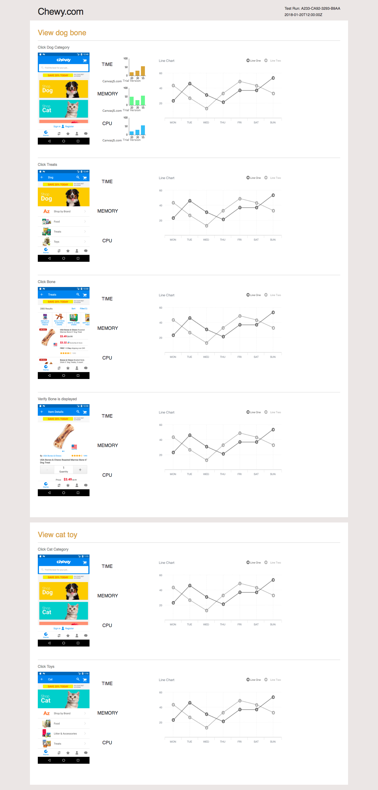

# Test AI Homework
### Completed by: Kristyn Bryan

To run this website locally:
1. Download the files.
2. No package installation or server needed, only internet connection for Angular CDN.

Notes:
- No style libraries used. Styling was done with vanilla CSS.
- Canvasjs was used for the bar charts.
- Only a screenshot was taken for the line graph. I ran out of time to tackle that.
- Not all of the data that was given was displayed. I ran out of time to have it displayed properly in the chart, but this would be the next step.
-  I did not have a chance to tackle mobile views. When thinking about mobile view, I would like remove the chart and show only the screenshot, categories, and bar graphs for a portrait view. Landscape may be able to fit the line chart. I was able to put in 1 media query to remove the line graph at a breakpoint.

### Mockup
Mockup created in Sketch:

### Screenshot of Actual Page
With the time limit that we had for the challenge, here is the resulting page screenshot:

